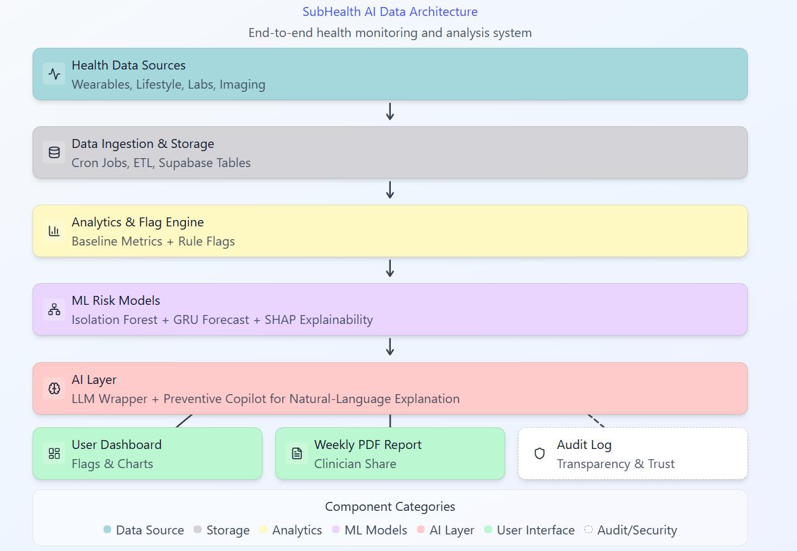
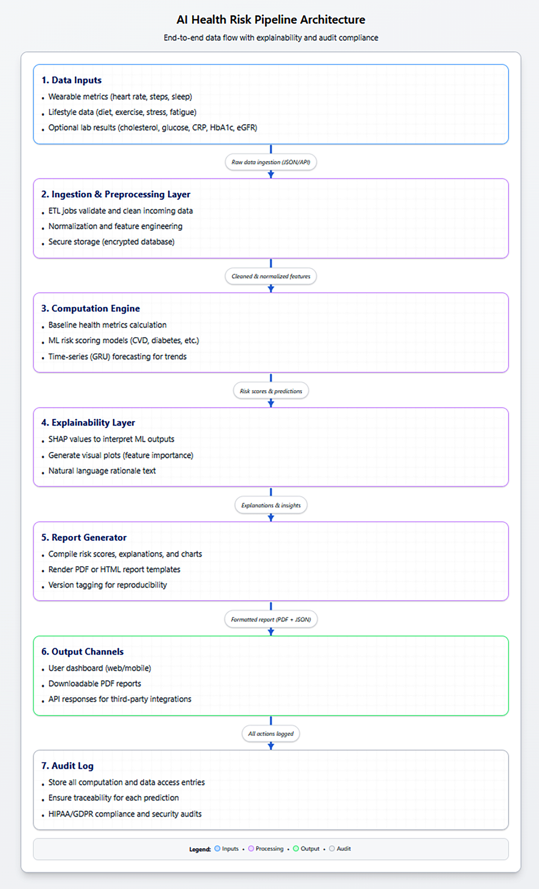
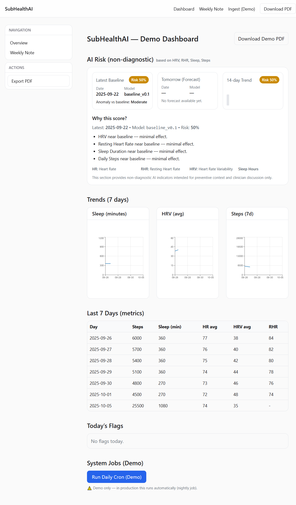
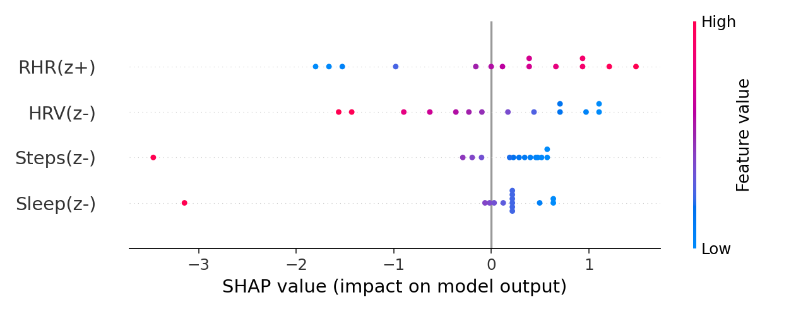
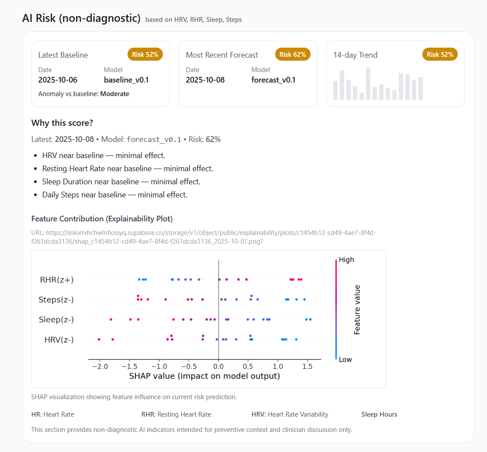
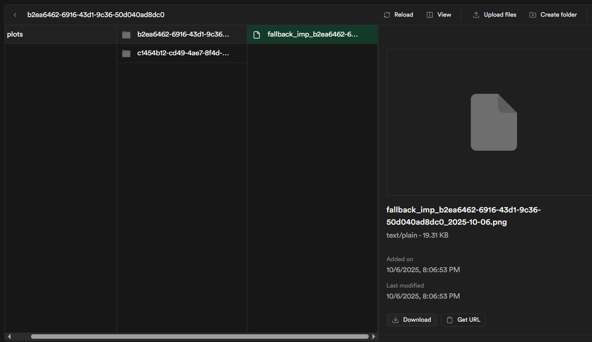
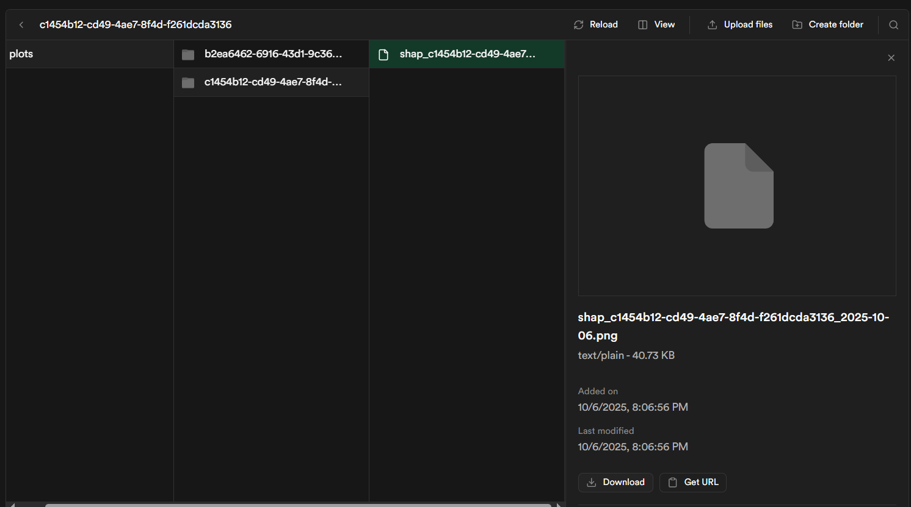
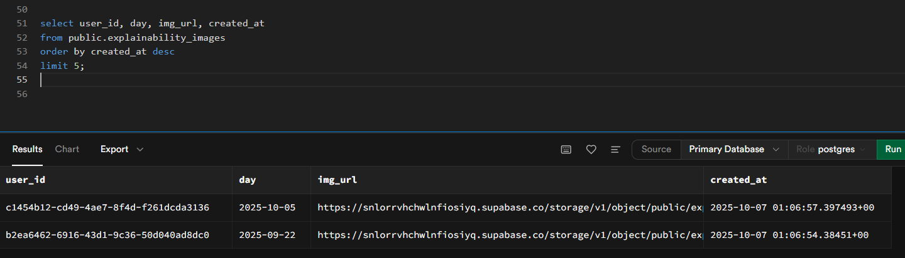
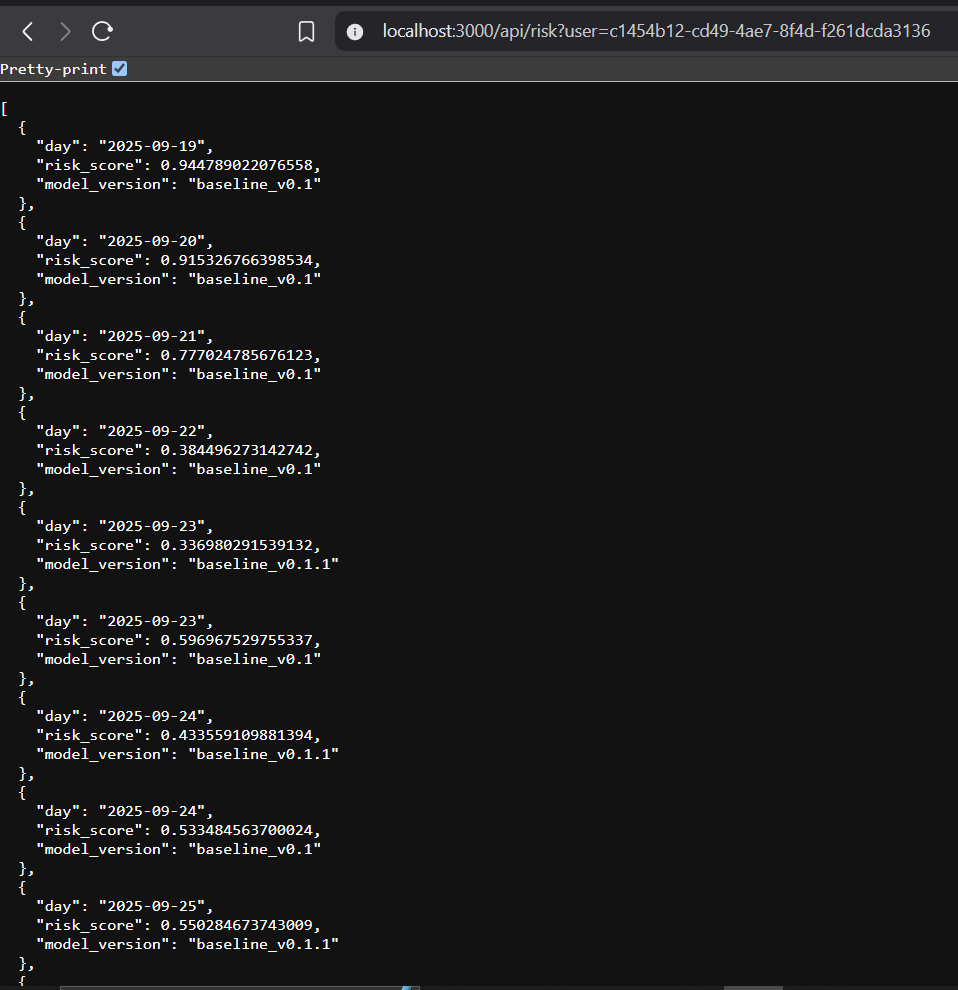
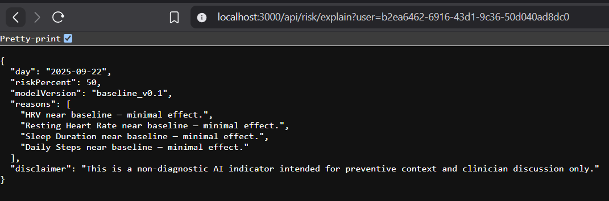

# SubHealthAI Whitepaper  

## 1. Abstract  
SubHealthAI is an **AI-powered preventive health platform** designed to surface *early warning signals of subclinical dysfunction* before they progress into diagnosable disease. By integrating wearable, lifestyle, and (future) optional patient-provided lab data, the system generates structured, explainable **risk flags**. These are **not medical diagnoses**, but **supportive insights for clinicians** that highlight longitudinal health patterns. By shifting healthcare from reactive treatment to proactive prevention, SubHealthAI aims to reduce the chronic disease burden, which accounts for more than **$4 trillion annually** in U.S. healthcare spending.  

---

## 2. Motivation & U.S. Burden  
- Chronic diseases represent **~90% of U.S. healthcare spending** (CDC, 2023).  
- Six in ten U.S. adults live with at least one chronic disease; four in ten live with two or more.  
- **Subclinical dysfunctions** — silent inflammation, metabolic imbalance, fatigue patterns — often remain undetected until advanced stages.  
- The consequences: reduced workforce productivity, shortened healthy lifespan, rising national healthcare costs.  
- Federal agencies (HHS, NIH, FDA) emphasize **preventive care and digital health innovation** as national priorities.  

**Gap today:**  
- Wearables generate valuable signals (HRV, sleep, steps) but provide them in isolation.  
- No structured integration across multiple inputs.  
- No longitudinal tracking (7/30/90-day trends).  
- No clinician-ready outputs that can plug into preventive workflows.  

SubHealthAI addresses this gap by turning fragmented consumer health data into **structured, actionable, and compliance-aware insights**.  

---

## 3. System Overview  
- **Inputs**  
  - Wearables (MVP): HR, HRV, resting HR, sleep, steps, activity.  
  - Lifestyle: stress, fatigue, irregular schedules, self-reported behaviors.  
  - Future: optional patient-provided labs (e.g., CRP, HbA1c, vitamin D).  

- **Processing**  
  - Metrics → rule-based health flags → AI-generated weekly summaries.  

- **Outputs**  
  - Weekly plain-language note for users.  
  - Clinician-ready PDF reports with tables, trend charts, and citations.  
  - Full audit logs for transparency and reproducibility.  

- **Scope**  
  - SubHealthAI is **not a diagnostic tool**.  
  - It provides structured early signals to assist clinicians today, with a long-term vision of empowering individuals under physician oversight.  

- **Compliance-first**  
  - HIPAA alignment, FDA digital health guidelines, and privacy-by-design principles are core to the system’s roadmap.

**SubHealthAI Architecture Overview**  

**Data Flow and Report Generation Process**  
  
*Illustrates how data flows from ingestion and preprocessing through ML risk computation, explainability, report generation, and audit logging.*

---

## 4. Architecture & Data Flow  
- **Database**: Supabase (Postgres) schema with `users`, `events_raw`, `metrics`, `flags`, `weekly_notes`, `audit_log`.  
- **Data ingestion**: ETL/CRON jobs pull deltas from wearable APIs and lifestyle trackers.  
- **Analysis engine**: computes metrics and applies flag rules.  
- **AI layer**: LLM wrapper with strict guardrails generates weekly notes and clinician-ready reports.  
- **Export**: dashboard, PDF, email.  
- **Audit log**: tracks all flags and outputs for transparency. 

**Figure 1: Live Dashboard View (Overview)**  
  
*Demonstrates SubHealthAI’s clinician-friendly dashboard summarizing user metrics and AI insights.*

---

## 5. Methods & Safeguards  

### 5.1 Flag Rules  
- Sleep debt accumulation  
- Low HRV relative to baseline  
- Elevated resting HR  
- Sedentary behavior  
- Irregular sleep/wake cycles  

### 5.2 Confidence Scoring  
- Each flag is paired with rationale and threshold logic.  
- Flags escalate only if consistent across 7/30/90-day windows → reduces false positives.  

### 5.3 Role of AI  
- **Current (MVP):**  
  - Restricted to **natural language generation**.  
  - Converts structured flags into plain-language weekly notes and clinician PDFs.  
  - Does **not** diagnose or classify disease.  
- **Future:**  
  - Anomaly detection, time-series forecasting, multimodal embeddings.  
  - Always framed as *flagging unusual patterns*, never diagnosis.  
- **Guardrails:**  
  - Reports include rationale, history, and supporting references.  
  - Prevent unsupported medical claims.  

### 5.4 Security & Privacy  
- End-to-end encryption, row-level security (RLS).  
- Privacy-first design to ensure compliance scalability.  
- HIPAA/FDA alignment considered from the start.  

---

## 6. Machine Learning Extension (Technical Deep Dive)

### 6.1 Baseline Model (Scikit-learn)
- Type: Isolation Forest with robust z-score normalization.
- Inputs: HRV_mean, RHR_mean, sleep_hours, steps.
- Method: builds per-user rolling baseline → detects anomaly → logistic squashing to 0–1 risk score.
- Output Table: `risk_scores(user_id, day, risk_score, model_version, features)`.

### 6.2 Forecast Model (PyTorch GRU)
- Type: Sequence-to-one GRU forecaster.
- Input Window: 14-day rolling sequences of health metrics.
- Output: Predicts next-day “risk proxy”; mapped via sigmoid to 0–1.
- Deployment: Automated via GitHub Actions nightly runs.

### 6.3 Explainability
- Linear surrogate + SHAP beeswarm plots for transparent feature attribution.
- Visuals: per-feature contribution (e.g., low HRV → +0.18 risk, high RHR → +0.22).
- Output: `/ml/outputs/shap_<user>_<date>.png`.

**Figure 2: Explainability Visualization (SHAP Plot)**  
  
*Demonstrates per-feature contribution visualization generated by SubHealthAI explainability engine.*

---

## 7. Results & Visualization

**Figure 3: AI Risk Panel (Dashboard Evidence)**  
  
*Shows real-time AI Risk badge, rationale bullets, and integrated explainability visualization.*

**Figure 4: Supabase Storage Buckets (Explainability Artifacts)**  
  
  
*All explainability plots are stored in Supabase for compliance and traceability.*

**Figure 5: Database Table — Explainability Records**  
  
*Each AI output is mapped to its explainability artifact, ensuring auditability.*

**Figure 6: API Evidence — Risk Endpoint**  

**Figure 7: API Evidence — Explainability Endpoint**  

*Both endpoints serve live JSON responses from the AI backend, proving functional ML integration.*

---

## 8. Compliance & Guardrails (Extended)
- All ML outputs carry disclaimer: *“This is not a diagnostic output; interpret with clinical oversight.”*
- Versioned model IDs recorded in `audit_log` for reproducibility.
- ML explainability visualizations available for every risk score.

---

## 9. Public Health Impact
- Quantified potential: early identification of “pre-illness” patterns.
- Preventive interventions guided by data → reduced ER visits & chronic-care costs.
- Alignment with:
  - CDC Preventive Health Framework.
  - NIH “Bridge2AI” initiative.
  - HHS Digital Health Strategy 2022.

---

## 10. Future Research Directions
- Multimodal fusion (lab + wearable + lifestyle).
- Personalized model retraining via federated learning.
- Real-time dashboards for clinicians.
- Open-source API for research collaboration.

---

## 11. Path Toward Diagnostic-Grade AI

While SubHealthAI currently functions as a preventive, non-diagnostic intelligence system,
its architecture is intentionally designed for future transition into validated clinical decision-support
and, ultimately, diagnostic use.  
This evolution follows established FDA “Software as a Medical Device” (SaMD) principles
and adheres to IEC 62304 life-cycle standards.

### 11.1 Roadmap Overview

| Phase | Description | Technical Focus | Regulatory Alignment |
|--------|--------------|-----------------|----------------------|
| **Phase I – Preventive Insight (Current)** | Detects subclinical dysfunction and early deviations from baseline | Isolation Forest + GRU + SHAP pipeline with auditable outputs | FDA Wellness Guidance (non-diagnostic) |
| **Phase II – Clinical Decision Support** | Generates structured summaries aiding clinician interpretation | Clinician feedback loop, calibration metrics, lab-linked validation dataset | FDA CDS (Class II pre-submission) |
| **Phase III – Diagnostic AI System** | Performs validated diagnostic inference for early-stage conditions | Prospective trials, ROC/AUC benchmarking, bias & safety testing | FDA SaMD 510(k)/De Novo pathway |

### 11.2 Implementation Principles
- **Auditability by design:** model versions, data provenance, and run logs already established via `audit_log`.  
- **Explainability continuity:** dynamic SHAP and linear surrogate models remain central to ensure transparent reasoning.  
- **Data governance:** privacy-preserving pipelines and encryption allow future IRB-approved clinical studies.  
- **Scalability:** modular API contracts and model registries support regulatory documentation and traceability.  

### 11.3 Long-Term Vision
SubHealthAI’s preventive foundation enables a smooth progression toward
FDA-aligned diagnostic support once sufficient clinical evidence and labeling data are collected.
This ensures that preventive analytics today become the foundation
for tomorrow’s validated diagnostic AI ecosystem.

---

## 12. Appendix
- Model architecture diagrams (baseline + forecast).
- Example Supabase schema.
- GitHub Actions YAML (nightly ML automation).
- SHAP visualization examples.

---
